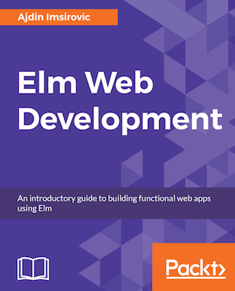

[](https://gitpitch.com/enogrob/ebook-project/master)
```
Roberto Nogueira  
BSd EE, MSd CE
Solution Integrator Experienced - Certified by Ericsson
```
# eBook Elm Web Development



**About**

Learn everything you need to about the subject of this `eBook` project.

[Homepage](https://www.packtpub.com/web-development/elm-web-development)

## Topics
```
1: WHY IS THIS A GREAT TIME TO LEARN ELM?
[ ] What is Elm?
[ ] Summary
2: BUILDING YOUR FIRST ELM APP
[ ] Let's build an app
[ ] Values, expressions, data structures, and types in Elm
[ ] Building a simple FizzBuzz app in Elm
[ ] Summary
3: CREATING YOUR PERSONAL PORTFOLIO WITH ELM
[ ] Creating our portfolio with elm-make-app
[ ] Building a static single-page portfolio
[ ] Improving our messages
[ ] Adding the type alias of Model
[ ] Working with List.map and List.filter
[ ] Revisiting the FizzBuzz app
[ ] Summary
4: PREPARING A UNIT CONVERSION WEBSITE IN ELM
[ ] What are we going to build?
[ ] Building our Unit Conversion app
[ ] Revisiting the FizzBuzz app
[ ] Summary
5: COMPLETING THE UNIT CONVERSION WEBSITE IN ELM
[ ] Improving the Unit Converter app
[ ] Adding type alias Model, initModel, and Main
[ ] A Bootstrap-based HTML layout for our app
[ ] Converting an HTML layout into an Elm view
[ ] Adding the improved view to our functioning app
[ ] Summary
6: EXPLORING ELM IN GREATER DETAIL
[ ] Destructuring values in Elm
[ ] Dealing with randomness in Elm
[ ] Understanding partial application
[ ] Summary
7: MAKING A WEATHER APP IN ELM
[ ] Obtaining the weather data from a third-party API
[ ] What are we going to build?
[ ] Building our weather app
[ ] Installing the HTTP package
[ ] Adding all the imports
[ ] Conceptualizing the model
[ ] Setting up Msg union type
[ ] Updating the update function
[ ] Updating the view
[ ] Summary
8: ADDING MORE FEATURES TO THE WEATHER APP
[ ] Importing Material and Round modules
[ ] Adding elm-mdl to our Model
[ ] Updating the init function
[ ] Updating the Msg union type and the update function
[ ] Updating the view function
[ ] Adding color schemes
[ ] Updating decodeTemperatureInfo
[ ] Summary
9: TESTING IN ELM
[ ] Introduction to Elm testing
[ ] Writing unit tests in Elm
[ ] Writing fuzz tests in Elm
[ ] Summary
10: INTEGRATING ELM WITH RAILS
[ ] Setting up a basic Rails 5.1.5 app using Codeanywhere
[ ] Installing Ruby 2.5.0 and Rails 5.1.5 on Codeanywhere
[ ] Creating a brand new Rails project
[ ] Integrating Elm with Rails 5.1.5
[ ] Adding our Elm weather app to our Rails app
[ ] Summary
```
